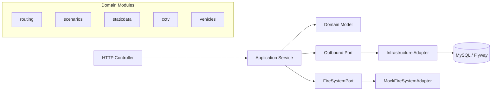

# Architecture

Fireway는 모듈 경계를 유지하는 Modular Hexagonal 구조를 사용합니다. `interfaces`는 HTTP 계약, `application`은 유스케이스와 port, `domain`은 순수 모델, `infrastructure`는 DB·외부 시스템 구현을 담당합니다. 현재 application layer의 mock 응답은 실제 adapter로 교체할 수 있도록 port를 남겨둔 스캐폴딩입니다.

| 모듈 | 담당 | 현재 역할 |
|---|---|---|
| routing / scenarios | 박종준 | 사전계산 경로와 화재 시나리오 |
| staticdata | 이태연 | No-Go 영역 |
| cctv | 유강현 | CCTV 판독 결과 |
| vehicles | 윤종호 | 차량 제원 |
