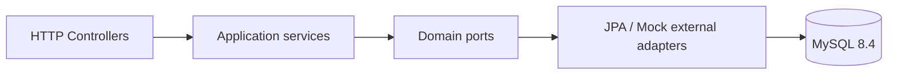

# Architecture
Golden Lane은 Spring MVC 기반 Modular Hexagonal 구조입니다. 외부 소방 시스템은 `FireSystemPort` 뒤에 격리하고 현재는 Mock adapter를 사용합니다. 경로 계산은 실시간이 아니라 DB에 저장된 사전 계산 결과를 조회합니다.

| 모듈 | 담당 | 책임 |
|---|---|---|
| routing | 박종준 | 사전 계산 경로 3안 조회 |
| staticdata | 이태연 | no-go 공간 데이터 |
| cctv | 유강현 | CCTV 판독 결과 서빙 |
| vehicles | 윤종호 | 차량 제원 |
| scenarios | 공용 | 시나리오 목록 |

